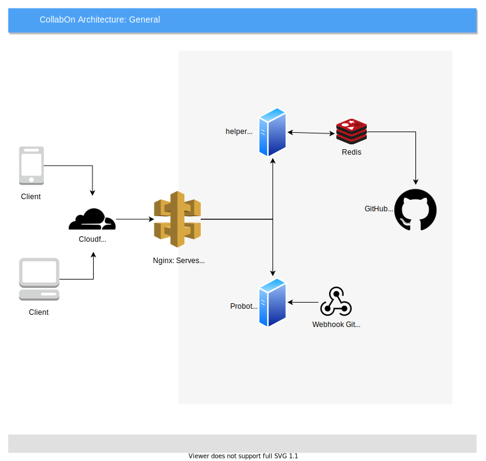

<div style="text-align:center"></div> 
# CollabOn

A GitHub App to get updates about teams and members in Organization.

# Installation

```
git clone https://github.com/MLH-Fellowship/CollabOn.git
cd CollabOn
docker-compose up
```
Go to http://localhost to access application

# Architecture  



# Tech Stack

- Front-End : Build using VueJs
- collabon : NodeJs, Probot, SQLite, GitHub WebHooks
- helper Service : NodeJs, GitHub API

# License
ISC

# Authors

- Gautam Mishra
- Biswajit Ghosh